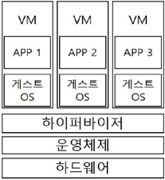
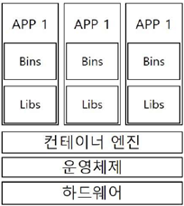

- 인프라 트렌드 변화
    서버 사기, 네트워크 연결, OS 설치 ---(클라우드 서비스)---> 인프라를 '소프트웨어'처럼 사용

- 소프트웨어 아키텍쳐의 변화
    모놀리식 아키텍처(하나의 서버) -> 마이크로서비스 아키텍처
    
- 마이크로서비스 아키텍처
    기능별로 물리적인 서버(인스턴스)의 위치를 다르게 설정
    보수가 쉽다. 자원관리 효율이 높아진다.

- 가상머신(VM) by Hypervisor(전가상화)
    가상화 기술을 통해 하나의 큰 서버를 쪼개서 마이크로 서비스의 해당 기능을 격리시킴
    실제 서버는 한 대. 하지만 여러 대의 서버를 사용하는 효과
    

- 컨테이너(Container)
    게스트 OS가 없다. 속도 빠르고, 사용 용량 적어지고... 배포에 용이해짐
    

마이크로 서비스의 개수도 많은데... 테스트 인프라 관리까지 ㅠㅠ -> DOCKER : 한 대의 물리적인 서버에서 운영

- Docker 대표 커널기술 : Cgroup
    Control Group
    시스템 CPU 시간, 시스템 메모리, 네트워크 대역 폭 등의 자원 제한 및 격리

- Docker 대표 커널기술 : Namespace
    시스템 리소스를 다른 프로세스와 격리시키는 가상화 기능
    UTS, IPC, PID, MNT, NET, USER ...

- 일반적인 배포 과정
    1. 로컬에서 개발, 소스코드 커밋
    2. 빌드, 배포요청
    3. CI/CD 서버가 커밋된 소스를 내려받고, 테스트와 빌드 및 jar,war 같은 배포단위의 파일 압축 만들기
    4. 원하는 환경에 서버에 이동시키고 실행시킨다.

 