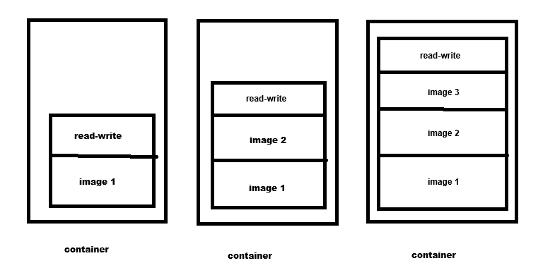

마이크로 서비스의 개수도 많은데... 테스트 인프라 관리까지 ㅠㅠ -> DOCKER : 한 대의 물리적인 서버에서 운영   
   
- Docker 대표 커널기술 : Cgroup   
    Control Group  
    시스템 CPU 시간, 시스템 메모리, 네트워크 대역 폭 등의 자원 제한 및 격리  
   
- Docker 대표 커널기술 : Namespace   
    시스템 리소스를 다른 프로세스와 격리시키는 가상화 기능   
    UTS, IPC, PID, MNT, NET, USER ...      
       
      
- 일반적인 배포 과정
    1. 로컬에서 개발, 소스코드 커밋   
    2. 빌드, 배포요청   
    3. CI/CD 서버가 커밋된 소스를 내려받고, 테스트와 빌드 및 jar,war 같은 배포단위의 파일 압축 만들기   
    4. 원하는 환경에 서버에 이동시키고 실행시킨다.   
   
- 도커 이미지
	 - 루트파일 시스템의 변경 사항 및 해당 실행 매개변수의 모음 (계층화된 파일 구조)
	 - ""컨테이너의 스냅샷"" (상태X, 변화X)
  	 - `docker images` : 도커 이미지 목록 확인
  	 - `docker pull nmginx` : 로컬 docker에 nginx 이미지 추가
  	 - `docker run --name nginx -p 8080:80 -d nginx` : 컨테이너 이름, 포트(내 PC:도커 컨테이너), detached mode 백그라운드 실행, 도커 이미지 이름
  	 - `docker ps` : 띄운 컨테이너의 정보 
    	 - `docker ps -a` : 삭제된 컨테이너까지 보이게 하기
    
- 도커 이미지 수정
  - 이미지 수정 -> 컨테이너 파일 수정 후 이미지 재생성  

  - 새 컨테이너 스냅샷 찍기
  1. `docker exec -it nginx /bin/bash` : 로컬(호스트)에서 도커 컨테이너의 쉘 실행하기
      - `find/(루트 디렉토리) -name(파일 이름)`: 컨테이너 안에서 파일 위치 찾기... 
      -  `exit` : 컨테이너에서 나오기
  2. `docker cp (로컬에 저장 할 로컬 디렉토리) (파일 이름)` : 컨테이너 내의 파일을, 로컬에 복사하기
      - 로컬에서 파일 수정하기
  3. `docker cp (파일 이름) (도커 컨테이너의 디렉토리)` : 로컬에서 수정된 파일 컨테이너에 복사하기
  4. `docker commit (컨테이너 이름) (새 이미지 이름)` : 한 파일이 수정된 지금의 컨테이너 사진찍기! (새 이미지 생성)
  5. `docker stop nginx`, `docker rm nginx` 로 기존 컨테이너 삭제하고, `docker run -d (새 이미지 이름)` 통해 새 이미지로 컨테이너 실행시키기!!
     
     
      (+) `docker rmi (이미지 이름)` : rm은 컨테이너 삭제, rmi는 이미지 삭제
   
  

  - 도커 파일 이용하기
    - Dockerfile : 명령어 묶음으로 이미지를 만드는 텍스트 파일
      1. Dockerfile 작성하기
      2. `docker build -t (이미지 이름):(태그 이름)` : 해당 Dockerfile 이 위치한 디렉토리에서 이미지 만들기 명령어 실행
      3. `docker run -d (새 이미지 이름)`: 새 이미지로 컨테이너 실행하기

(+) 리눅스 커널 기반인 도커를 이용하기 위해 Hyper-V, AWS EC2, GCP VM 인스턴스 등을 통해 가상화 서버 구축하기   
(+) 가상화 서버를 만들 때(클라우드를 사용할 때), 서비스를 제공하는 지역과 가까운 Region(데이타 센터 묶음)을 선택해줘야 한다.   
(+) OS : 소프트웨어 시스템, 커널(Kernel) : OS의 핵심 구성 요소이자,하드웨어와 소프트웨어 간의 중개자

- 도커를 사용한 테스트 환경 구축

  - 기본적으로 용도별로 서버가 2대 이상씩 있고, 트래픽이 늘으면 application 서버 등의 수를 증가시킨다. -> 서버가 늘어날 때마다 해야할 반복작업이 늘어남..(서버 설정, 어플리케이션 배포, 모니터링 ...)
  - 도커 이전 : 기본 명령어 모음 자동화 스크립트
  - 도커 이후 : 그저 컨테이너 숫자만 늘려주면 됨(와 간단하당!)
      
  - 도커를 설치하고, 웹 서비스를 구동(서버 시작)하여 로컬에서 만든 클라우드 웹 서비스에 접속하기 위해 http 트래픽 허용(포트 80 허용)
  - GCP는 웹 브라우저를 통한 SSH(다른 컴퓨터에 접근하여 명령어 실행하게 하는 프로토콜) 접근
  - AWS는 EC2에 접속하기 위해 PuTTY(SSH 클라이언트) 사용, PuTTYgen 통해서 SSH 키 형식 변환 
      
  - MySQL은 도커 허브에서 공식 이미지로, MySQL 컨테이너 실행시키기
  - 테스트 서버에 배포된 SpringBoot의 jar 파일(Maven, Gradle 같은 빌드 도구를 이용하여 만들어진 실행파일)
    - .java -(컴파일)-> .class(바이트 코드) -(jvm이 클래스 파일 실행)
    - .jar 실행파일은 여러개의 .class 파일과 리소스 들이 있다.. jvm은 jar 파일을 실행하는 구조
    
  - 도커 컨테이너: 이미지를 기반으로 실행된 실행 환경. 이미지의 read-only 계층 위에 read-write 계층을 추가하여 실행된다.
  - 
    - 이미 생성되어 있는 이미지에 실행 파일(jar)을 넣어서 새 이미지를 만들고, 만든 새 이미지를 베이스로 컨테이너 실행.
    - 예) openjdk 이미지를 참조하여 베이스로(read-only) Springboot 이미지 생성
    - `docker history` : 도커 이미지가 어떻게 생성되었는지 보여줌 (부모 이미지 참조과정)
    
    - `docker logs (컨테이너 명)` 
      - `-f` : 실행되는 로그 실시간 모니터링
      - `- tail 100` : 마지막 100줄 보기(가장 최근의 로그 백줄 보기)
    

  - 기존 CI를 통한 배포 과정
  1. 소스 코드 깃에 업데이트
  2. CI 서버가 깃에 변경사항이 푸시되는 것을 감지하고, 푸시된 소스 파일을 컴파일 하여 빌드까지함.. jar 파일 만들음
      - 자동화된 빌드 과정은 "내 컴퓨터에서는 되는데" 문제 예방..
  3. 빌드된 파일(jar 파일)은 운영 서버로 전송됨.
 

  - 도커 이용 초창기
  1. CI 서버에서 jar 파일 만들고, 운영 서버에 전송
  2. jar 파일을 컨테이너에 복사 후 재시작
     -> 컨테이너를 실행시킨 후 파일만 변경하는 방식    *** 이미지 빌드와 컨테이너 실행이 같은 서버에서 이루어짐 ***
     -> 테스트 서버가 이전할 경우 : 처음부터 컨테이너 새로 실행하고, 어플리케이션 재배포해야됨..

  - CI와 도커 레지스트리(도커 허브)를 이용한 배포 과정
   1. 도커 허브에서 레포지토리 만들기
   2. `docker login`, `docker tag (이미지 이름) (도커허브 아이디)/(새 이미지 명):(태그)` 
   3. `docker push (아이디)/(새 이미지 명)` : 이미지를 도커허브에 푸시    ***이미지는 CI 서버에서 만들고, 그 이미지를 도커허브에 푸시, 운영서버가 도커허브에 올라온 이미지 다운로드해서 컨테이너 실행 ***
     
   -> 도커허브는 하나의 레포리토지만 무료, 직접 도커 레지스트리를 만들어서 운영하는 방법이 있다. (`docker pull registry`후, 다운받은 레지스트리 이미지로 컨테이너 `docker run`)   
   ※ 레지스트리 관련 자세한 설명 정리 생략
   

- 도커 레지스트리를 이용한 배포의 장점
  1. CI 서버와 테스트 서버의 물리적인 공간이 다름(이미지 생성하는 곳, 컨테이너 실행하는 곳)
  2. 새로 추가한 소스에 에러 有 -> 이전 버전으로 롤백 필요
    - 도커에서는 태그를 버전별로 사용했기 때문에 이전 버전으로 쉽게 롤백이 가능
    
  3. 로컬에 테스트 시
    - 여러개의 마이크로 서비스를 운영하는 회사에서, 신규 개발과 기존 기능의 버그 수정이 동시에 일어날 경우 -> 두 변경사항을 한 서버에서 테스트해야함 ㅠㅠ 충돌 발생확률 多, 영향 분석 어려움
      - 도커를 이용하면 테스트 서버를 로컬에서 구동할 수 있다. 이미지가 있기에 환경 구축이 안 되어있어도 상관 없다.

